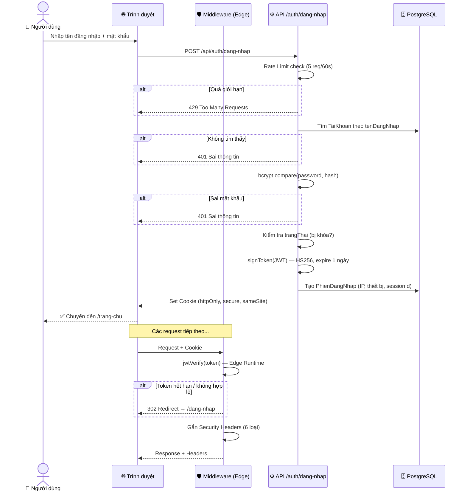
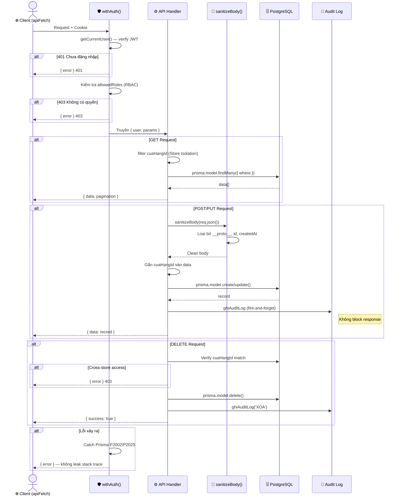
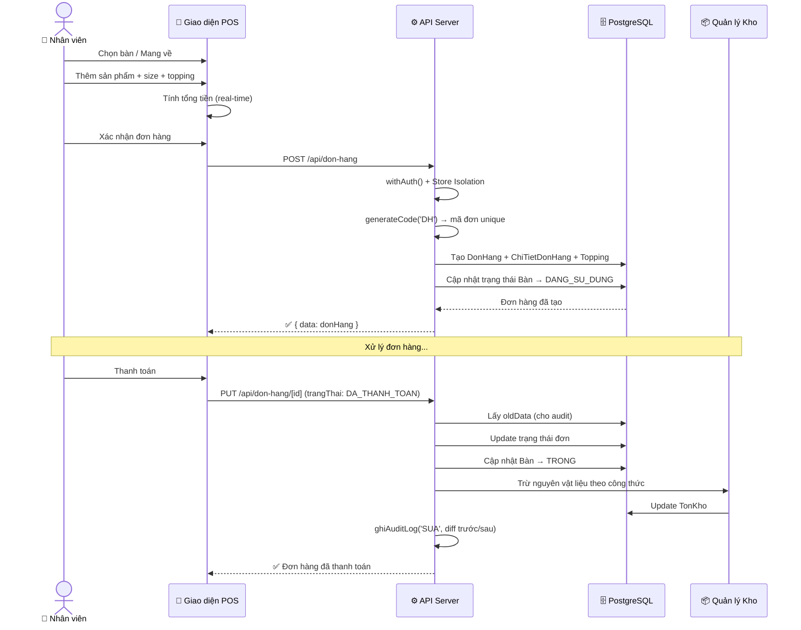
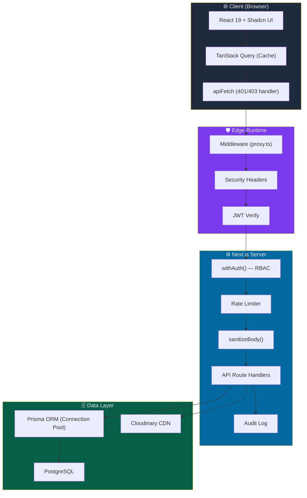

# 📋 Đánh Giá Hệ Thống POS — Bảo Mật, Khả Năng Mở Rộng & Công Nghệ

> Tài liệu dành cho khách hàng — đánh giá toàn diện hệ thống quản lý POS (Point of Sale).

---

## 1. Tổng Quan Công Nghệ

| Thành phần | Công nghệ | Phiên bản | Ghi chú |
|---|---|---|---|
| **Framework** | Next.js (App Router) | 16.1.6 | Framework React hàng đầu, hỗ trợ SSR/SSG/Edge Runtime |
| **Ngôn ngữ** | TypeScript | 5.x | Type-safe, giảm lỗi runtime |
| **Database** | PostgreSQL + Prisma ORM | Prisma 6.19.2 | RDBMS  + ORM type-safe |
| **UI Library** | Shadcn UI + Radix UI | Latest | Accessible, customizable, production-grade |
| **State Management** | TanStack Query | 5.90+ | Cache, sync, pagination tự động |
| **Styling** | Tailwind CSS | 4.x | Utility-first, responsive, tree-shaking |
| **Auth** | JWT (jose) + bcrypt | jose 6.1, bcrypt 3.0 | Edge Runtime compatible |
| **Encryption** | AES-256-GCM | Node.js crypto | Mã hóa bí mật API trong database |
| **File Storage** | Cloudinary | 2.9 | CDN toàn cầu, xử lý ảnh tự động |
| **Runtime** | Node.js | ≥20.9.0 | LTS, hỗ trợ dài hạn |

---

## 2. Kiến Trúc Bảo Mật 🔒

### 2.1. Xác Thực (Authentication)

| Tính năng | Chi tiết | Mức độ |
|---|---|---|
| **Mã hóa mật khẩu** | bcrypt với salt rounds = 12 | ✅ Tiêu chuẩn ngành |
| **JWT Token** | HMAC-SHA256 (HS256) qua thư viện `jose` | ✅ Edge Runtime compatible |
| **Token hết hạn** | 1 ngày (24 giờ), tự động redirect khi expired | ✅ Giảm rủi ro token bị đánh cắp |
| **HttpOnly Cookie** | Token lưu trong cookie `httpOnly: true` | ✅ Chống XSS đánh cắp token |
| **Secure Cookie** | `secure: true` trên production (HTTPS only) | ✅ Chống MITM |
| **SameSite** | `lax` — chống CSRF cơ bản | ✅ |
| **Session tracking** | Model `PhienDangNhap` — ghi nhận thiết bị, IP, thời gian | ✅ Audit trail đăng nhập |
| **Session revocation** | Hỗ trợ thu hồi session (Revoked status) | ✅ Khóa phiên từ xa |

### 2.2. Phân Quyền (Authorization — RBAC)

| Tính năng | Chi tiết |
|---|---|
| **Vai trò hệ thống** | `QuanTriVien`, `NhanVien`, `KhachHang` — 3 cấp rõ ràng |
| **RBAC trên API** | [withAuth()](file:///e:/Goalcrm/AppGoal/pos-goal-v1/src/lib/api-handler.ts#17-86) wrapper kiểm tra `allowedRoles` trước khi thực thi |
| **Phân quyền chi tiết** | Model `PhanQuyen` — quyền theo phòng ban + chức vụ: `xem`, `them`, `sua`, `xoa` |
| **Cô lập dữ liệu** | Mỗi cửa hàng chỉ thấy dữ liệu của mình (Store Isolation via `cuaHangId`) |

### 2.3. Bảo Vệ API

| Biện pháp | Triển khai |
|---|---|
| **Rate Limiting** | In-memory rate limiter — giới hạn request/IP/endpoint (VD: 5 req/60s cho login) |
| **Input Sanitization** | [sanitizeBody()](file:///e:/Goalcrm/AppGoal/pos-goal-v1/src/lib/api-handler.ts#129-168) — loại bỏ `__proto__`, `constructor`, `prototype`, `id`, `createdAt` trước khi write DB |
| **Prototype Pollution Protection** | Recursive sanitize, chặn injection qua nested objects |
| **Prisma Error Handling** | Tự động xử lý `P2002` (trùng dữ liệu), `P2025` (không tìm thấy) |
| **Centralized Error Handler** | [withAuth()](file:///e:/Goalcrm/AppGoal/pos-goal-v1/src/lib/api-handler.ts#17-86) bắt mọi exception, trả `{ error }` chuẩn — không leak stack trace |

### 2.4. Security Headers (Middleware)

Tất cả response đều được gắn headers bảo mật qua [proxy.ts](file:///e:/Goalcrm/AppGoal/pos-goal-v1/src/proxy.ts):

| Header | Giá trị | Tác dụng |
|---|---|---|
| `X-Content-Type-Options` | `nosniff` | Chống MIME sniffing |
| `X-Frame-Options` | `DENY` | Chống Clickjacking |
| `Referrer-Policy` | `strict-origin-when-cross-origin` | Giới hạn thông tin referrer |
| `X-XSS-Protection` | `1; mode=block` | Chống XSS (legacy browsers) |
| `Permissions-Policy` | `camera=(), microphone=(), geolocation=()` | Vô hiệu hóa API thiết bị nhạy cảm |
| `Strict-Transport-Security` | `max-age=31536000; includeSubDomains; preload` | Bắt buộc HTTPS (production) |

### 2.5. Mã Hóa Dữ Liệu Nhạy Cảm

| Tính năng | Chi tiết |
|---|---|
| **Thuật toán** | AES-256-GCM — mã hóa đối xứng mạnh nhất |
| **Áp dụng** | API Secret (Cloudinary) được mã hóa trước khi lưu DB |
| **Format** | `iv:authTag:ciphertext` (hex-encoded) |
| **Backward compatible** | Tự phát hiện dữ liệu plaintext cũ, không bị lỗi |

### 2.6. Nhật Ký Hệ Thống (Audit Log)

| Tính năng | Chi tiết |
|---|---|
| **Ghi nhận** | Mọi thao tác CÀI ĐẶT/TẠO/SỬA/XÓA/DUYỆT/NHẬP DỮ LIỆU |
| **Thông tin** | Ai thực hiện, thời gian, IP, User-Agent, nội dung thay đổi |
| **Diff chi tiết** | So sánh dữ liệu trước/sau, ghi rõ từng trường thay đổi |
| **Smart skip** | Không ghi log nếu dữ liệu không thực sự thay đổi |
| **Fire-and-forget** | Không ảnh hưởng performance của API chính |
| **Bảo vệ** | Không log mật khẩu, bỏ qua field hệ thống (`id`, `createdAt`) |

---

## 3. Khả Năng Mở Rộng (Scalability) 📈

### 3.1. Database Scalability

| Tính năng | Chi tiết |
|---|---|
| **PostgreSQL** | Hỗ trợ horizontal scaling (read replicas), partitioning, JSONB indexes |
| **Connection Pooling** | Tự động `connection_limit=10` + `pool_timeout=10` (serverless-ready) |
| **Singleton Pattern** | Prisma Client singleton — tránh connection leak |
| **Database Indexes** | 20+ index trên các trường hay query (`createdAt DESC`, `cuaHangId`, `trangThai`, v.v.) |
| **Prisma Accelerate** | Sẵn sàng tích hợp cho production (connection pooling + caching) |
| **PgBouncer** | Compatible — có thể thêm connection pooler bên ngoài |

### 3.2. Application Scalability

| Tính năng | Chi tiết |
|---|---|
| **Serverless-ready** | Next.js App Router — auto-scales trên Vercel, AWS Lambda |
| **Edge Runtime** | Middleware chạy trên Edge (nhanh hơn, gần user hơn) |
| **API Pagination** | [parsePagination()](file:///e:/Goalcrm/AppGoal/pos-goal-v1/src/lib/api-handler.ts#87-103) + [paginationMeta()](file:///e:/Goalcrm/AppGoal/pos-goal-v1/src/lib/api-handler.ts#104-115) chuẩn — xử lý dataset lớn |
| **Large Dataset** | Manual pagination + server-side filter cho >1000 rows |
| **Client-side Cache** | TanStack Query — staleTime, refetch on focus, cache invalidation |
| **Search Debounce** | 500ms debounce — giảm API calls |

### 3.3. Multi-Store Architecture

| Tính năng | Chi tiết |
|---|---|
| **Cô lập dữ liệu** | Mỗi cửa hàng = 1 tenant riêng, filter tự động qua `cuaHangId` |
| **10+ models** | `TaiKhoan`, `PhongBan`, `SanPham`, `DonHang`, v.v. đều hỗ trợ multi-store |
| **Bảo vệ cross-store** | API verify `cuaHangId` match trước khi cho phép sửa/xóa |
| **Admin toàn quyền** | QuanTriVien không gắn `cuaHangId` → xem toàn bộ dữ liệu |

### 3.4. File Storage

| Tính năng | Chi tiết |
|---|---|
| **Cloudinary CDN** | File được lưu trên CDN toàn cầu — load nhanh mọi nơi |
| **Multi-account** | Hỗ trợ nhiều tài khoản Cloudinary, tự động chọn active account |
| **Giới hạn** | Ảnh: 5MB, File: 10MB — chống abuse |

---

## 7. Luồng Hoạt Động Hệ Thống 🔄

### 7.1. Luồng Đăng Nhập & Xác Thực

### 7.2. Luồng Xử Lý API Request

### 7.3. Luồng Đơn Hàng POS

### 7.4. Kiến Trúc Tổng Quan

---

> **Kết luận:** Hệ thống đã triển khai đầy đủ các biện pháp bảo mật tiêu chuẩn công nghiệp (JWT, bcrypt, AES-256-GCM, RBAC, Security Headers, Audit Log). Kiến trúc multi-store tenant + serverless-ready cho phép mở rộng linh hoạt. Tech stack sử dụng các framework/library mới nhất và được cộng đồng hỗ trợ rộng rãi.
